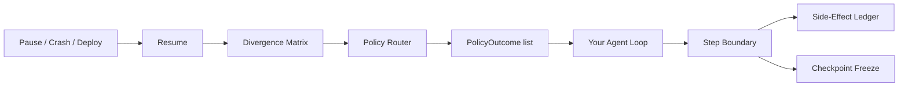

<p align="center">
  
</p>

<p align="center">
  <strong>Your agent loop decides what to do. Semarun remembers what already happened.</strong>
</p>

<p align="center">
  <a href="https://www.python.org/downloads/"></a>
  <a href="LICENSE"></a>
  <a href="https://pypi.org/project/semarun/"></a>
</p>

<p align="center">
  Vendor-neutral mechanical state kernel for long-running Python agents.<br/>
  Pause for hours, survive crashes and deploys, resume under a different model or tool result — without redoing completed work.
</p>

<br/>

```python
from semarun import (
    FailFast,
    PolicyMapping,
    RevalidateWithPrompt,
    SemarunRuntime,
)
from semarun.models.artifacts import ModelIdRef, ResumeArtifacts

runtime = SemarunRuntime(
    policy_mapping=PolicyMapping(
        tool_result_hash_mismatch="RevalidateWithPrompt",
        model_id_changed="FailFast",
    ),
    revalidation_template="assert_tools.py",
)
runtime.registry.register(RevalidateWithPrompt(template="assert_tools.py"))

run = runtime.create_run(
    intent="Complete onboarding outreach sequence",
    plan=["research lead", "draft email", "request approval", "send email"],
)

with run.step("tool_call", name="crm_lookup") as step:
    result = crm.lookup("lead_42")
    step.set_tool_result("crm_lookup", result, hash_exclude=["created_at", "request_id"])

with run.step("llm_call", model="gpt-4.1-2026-07"):
    run.state.working_memory.set_slot("draft_email", llm.generate(...), step_id=step.step_id)

run.request_approval(action="send_email", payload={"draft": run.state.working_memory.get("draft_email")})
# ... process exits, days pass ...

run = runtime.resume(run.id)
matrix = run.compute_divergence_matrix(
    ResumeArtifacts(
        tool_results={"crm_lookup": fresh_crm_data},
        model_id=ModelIdRef(model_family="gpt-4.1", model_version="2026-07"),
    )
)
if matrix.has_divergence:
    outcomes = run.route_policies(matrix)  # declarative only — your agent executes them
```

```
Naive restart (step 7 crash):  ████████  8 LLM calls
Semarun resume:                █         1 LLM call
```

## What Semarun Is

Semarun is a **standalone in-process state kernel** — not a LangGraph plugin, not a Temporal worker, not an orchestration framework.

| Layer | Responsibility | Semarun |
|-------|----------------|---------|
| **Kernel** (mechanical) | Ledger, artifact diffing, divergence matrix | Booleans + exact deltas only — zero AI, zero heuristics |
| **Policies** (your contract) | Named hooks map matrix flags to outcomes | `FailFast`, `RevalidateWithPrompt`, `StrictReset`, custom hooks |
| **Host agent** | Plan, LLM calls, tool execution | Reads `PolicyOutcome` and acts — kernel never mutates intent or replans |



## The Problem

- Agents crash, deploy, wait for humans, and change models — replay-first systems cannot detect artifact drift.
- Re-running from step 1 wastes tokens, time, and corrupts intent.
- You need **mechanical divergence detection** plus **explicit reconciliation policies** — not kernel-side guessing.

## Performance & Overhead

```
[Semarun Overhead Stats]
  • Checkpoint Snapshot Latency:  ~1–8 ms (SQLite local write)
  • Memory Overhead:              < 4 MB resident set size
  • Token Savings on Resume:      Up to 98% of prior execution steps
```

*Measured locally on developer hardware. Benchmark scripts are not shipped in the public repo.*

LLM API calls take **1,000–3,000+ ms**. Semarun adds **<10 ms** per step boundary — zero noticeable lag to the agent loop.

In an **8-step agent run where step 7 fails**, Semarun resumes from the last checkpoint, saving **~75%** of execution cost and time versus a full restart.

## Architecture

### Mechanical kernel (`semarun/kernel/`)

- **Side-effect ledger** — append-only record of tool calls, file writes, model invocations at step boundaries
- **Artifact diff** — schema hashes, file-tree merkle hashes, model IDs, tool result hashes (reuses canonical hashing with `hash_exclude`)
- **Divergence matrix** — pure boolean flags + exact before/after deltas; no semantic inference

```python
class DivergenceMatrix:
    tool_schema_changed: bool
    tool_result_hash_mismatch: dict[str, bool]   # tool_name → changed
    file_tree_hash_mismatch: bool
    model_id_changed: bool
    intent_string_changed: bool
    plan_sequence_changed: bool
    approval_state_changed: bool
    behavioral_drift_flagged: bool                 # set only by explicit caller input
    deltas: dict[str, Any]                         # mechanical diffs only
```

### Policy contract (`semarun/policies/`)

You declare which hook runs for each matrix flag. The kernel routes — it does not guess.

| Hook | Outcome | Use when |
|------|---------|----------|
| **FailFast** | `abort` | Model swap, critical file-tree change |
| **RevalidateWithPrompt** | `run_assertions` | Tool result or schema drift — returns your template + assertion list |
| **StrictReset** | `load_checkpoint` | Roll back to last-green checkpoint (you mark which) |
| **BehavioralDriftPolicy** | `halt_for_human` | Caller explicitly sets `behavioral_drift_flagged=True` with reason |

```python
runtime = SemarunRuntime(
    policy_mapping=PolicyMapping(
        tool_result_hash_mismatch="RevalidateWithPrompt",
        model_id_changed="FailFast",
        file_tree_hash_mismatch="FailFast",
        behavioral_drift_flagged="BehavioralDriftPolicy",
    ),
)
```

`PolicyOutcome` is declarative: `{ action, payload }`. Your host agent executes outcomes — Semarun never calls an LLM or mutates plan/intent inside the kernel.

### Typed state (`semarun/models/`)

| Type | Purpose |
|------|---------|
| `ActiveIntent` | Versioned intent text with schema version |
| `VerifiedWorkingMemory` | Named slots with schema ref, content hash, source step |
| `ToolResultCommitment` | Tool name, schema hash, result hash, `hash_exclude`, step id |
| `GreenCheckpointRef` | User/policy-marked last-known-good checkpoint |
| `Checkpoint` | Frozen snapshot of typed `AgentState` + artifact refs |

## Where Semarun Sits in the Stack

Semarun is **framework-agnostic infrastructure** — embed it in any Python agent loop.

| Category | Examples | Semarun role |
|----------|----------|--------------|
| Durable execution | Temporal, Restate | In-process alternative: no workers, no replay journal — artifact diff + checkpoint |
| Agent frameworks | LangGraph, PydanticAI, CrewAI | State kernel beneath your loop; you wire policy outcomes back in |
| Memory / RAG | Mem0, Zep | Runtime execution state + tool commitments — not long-term user facts |
| Inference serving | vLLM, SGLang | Checkpoints Python agent state, not model KV tensors |

> Unlike distributed orchestrators that replay function calls, Semarun diffs **artifacts** (tool results, schemas, file trees, model IDs) and returns **policy outcomes** for your agent to act on.

## API Reference

| Method | Purpose |
|--------|---------|
| `SemarunRuntime(...)` | Create runtime with `PolicyMapping` and optional hooks |
| `runtime.create_run(intent, plan=...)` | Start a new agent run |
| `runtime.resume(run_id)` | Load latest checkpoint and resume |
| `run.step(type, name=...)` | Context manager for step boundaries (records to ledger) |
| `step.set_tool_result(name, result, hash_exclude=[...])` | Commit tool output with semantic hash |
| `run.checkpoint()` | Force a state snapshot |
| `run.pause()` | Pause run and checkpoint |
| `run.request_approval(action, payload)` | Human approval gate |
| `run.compute_divergence_matrix(ResumeArtifacts(...))` | Mechanical boolean matrix vs checkpoint |
| `run.route_policies(matrix)` | Dispatch matrix flags → `list[PolicyOutcome]` |
| `run.export_checkpoint_json(path)` | Export raw checkpoint JSON for debugging |

## Examples

```bash
python examples/outreach_agent.py
python examples/multi_vendor_interrupt.py
```

- **outreach_agent.py** — CRM lookup → LLM draft → approval gate → resume with tool drift → `RevalidateWithPrompt`
- **multi_vendor_interrupt.py** — mock OpenAI + Anthropic model IDs, tool schemas, file tree; crash → resume → matrix → policy routing

## Install & Development

```bash
pip install semarun
# or from source:
pip install -e ".[dev]"
pytest
```

## License

MIT
