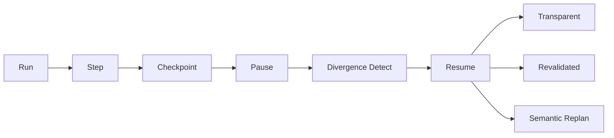

<p align="center">
  
</p>

<p align="center">
  <strong>Durable execution replays your agent. Semarun remembers what it learned.</strong>
</p>

<p align="center">
  <a href="https://www.python.org/downloads/"></a>
  <a href="LICENSE"></a>
  <a href="https://pypi.org/project/semarun/"></a>
</p>

<p align="center">
  Semantic checkpointing runtime for long-running Python agents.<br/>
  Pause for hours, survive crashes and deploys, resume under a different model or tool result — without redoing completed work or corrupting intent.
</p>

<br/>
```python
from semarun import SemarunRuntime, ContinuationPolicy

runtime = SemarunRuntime()
run = runtime.create_run(
    intent="Complete onboarding outreach sequence",
    plan=["research lead", "draft email", "request approval", "send email"],
    continuation_policy=ContinuationPolicy(
        on_tool_drift="revalidate",
        on_model_change="resume_with_warning",
        on_user_change="replan",
    ),
)

with run.step("tool_call", name="crm_lookup") as step:
    result = crm.lookup("lead_42")
    step.set_tool_result("crm_lookup", result, hash_exclude=["created_at", "request_id"])

with run.step("llm_call", model="gpt-4.1-2026-07"):
    run.state.working_memory["draft_email"] = llm.generate(...)

run.request_approval(action="send_email", payload={"draft": run.state.working_memory["draft_email"]})
# ... process exits, days pass ...

run = runtime.resume(run.id)
report = run.detect_divergence(fresh_tool_results={"crm_lookup": fresh_crm_data})
action = run.apply_continuation(report)
```

```
Naive restart (step 7 crash):  ████████  8 LLM calls
Semarun resume:              █         1 LLM call
```

## The Problem

- Agents crash, deploy, wait for humans, and change models — replay-first systems cannot handle semantic drift.
- Re-running from step 1 wastes tokens, time, and corrupts intent.
- You need **semantic resumption**, not transcript replay.

## Performance & Overhead

```
[Semarun Overhead Stats]
  • Checkpoint Snapshot Latency:  ~1–8 ms (SQLite local write)
  • Memory Overhead:              < 4 MB resident set size
  • Token Savings on Resume:      Up to 98% of prior execution steps
```

*Measured locally on developer hardware. Benchmark scripts are not shipped in the public repo.*

LLM API calls take **1,000–3,000+ ms**. Semarun adds **<10 ms** per step boundary — zero noticeable lag to the agent loop.

In an **8-step agent run where step 7 fails**, Semarun resumes from the last checkpoint, saving **~75%** of execution cost and time versus a full restart.

## Where Semarun Sits in the Stack

### Layer 1 — Durable Execution Engines

| Tool | Role | Semarun contrast |
|------|------|-------------------|
| **Temporal** | Distributed workflow orchestration with replay | Requires separate workers/server daemons; replay-first, not semantic |
| **Restate** | Event-driven durable execution with journaled logs | Zero-infrastructure alternative: Semarun runs in-process, no external daemon |
| **Prefect / Dagster** | Python data orchestrators (ETL, caching, retries) | Pipeline-scale orchestration vs fine-grained agent turn state + semantic hashing |
| **Inngest** | Event-driven serverless step functions | Serverless workflow retries vs local-first semantic checkpointing |

> Unlike heavy distributed orchestrators (Temporal, Restate) that require separate workers or server daemons, Semarun is an **in-process, zero-dependency Python runtime** for local-first agent state.

### Layer 2 — Agent Frameworks & Orchestrators

| Tool | Role | Semarun contrast |
|------|------|-------------------|
| **LangGraph** | Graph checkpointing + memory savers | Flexible checkpoint/divergence kernel for custom Python loops |
| **PydanticAI** | Pydantic-native agent framework | Shared philosophy: strongly-typed state; Semarun is the durable runtime underneath |
| **CrewAI / AutoGen** | Multi-agent message orchestration | Deterministic state hashing + resumption beneath multi-agent conversations |
| **LlamaIndex Workflows** | Event-driven agent execution loops | Plugs in as semantic state + drift handler |

> Works alongside or inside your favorite agent loops (LangGraph, PydanticAI, CrewAI) to handle semantic replay, tool drift, and state resumption.

### Layer 3 — Storage, Memory, & Cache

| Tool | Role | Semarun contrast |
|------|------|-------------------|
| **SQLite / DuckDB** | Local embedded databases | Primary default backend — zero-infra snapshot persistence |
| **Mem0 / Zep** | Long-term semantic memory (RAG, chat history) | Mem0 = long-term user facts; Semarun = runtime execution state + tool checkpoints |
| **LMDB / RocksDB** | High-throughput KV stores | Future optional backend for ultra-fast filesystem persistence |
| **Redis** | Generic KV cache | Code-level execution checkpoints with semantic hashing, not generic KV |

> Semarun manages **runtime execution drift**—not long-term chat memory (like Mem0) or KV caching (like Redis). It bridges execution history directly to local disk (SQLite) or cloud stores.

### Layer 4 — Serving & Observability

| Tool | Role | Semarun contrast |
|------|------|-------------------|
| **SGLang / vLLM** | High-performance LLM serving (KV cache, RadixAttention) | Application-level equivalent: checkpoints Python code + tool states, not model KV tensors |
| **Arize Phoenix / OpenInference** | Agent tracing + evaluation | Audit events align with OpenInference-style traces for time-travel debugging |

### Landscape / Alternatives

| Category | Tool | How Semarun Differs |
|----------|------|----------------------|
| Durable Execution | Temporal / Restate | Zero daemon processes; runs entirely in-process inside Python. |
| Agent Frameworks | LangGraph / CrewAI | Framework-agnostic runtime kernel; focuses strictly on state & hashing logic. |
| State & Caching | Redis / Mem0 | Designed for code-level execution checkpoints and tool drift, not generic KV or facts. |
| Inference | vLLM / SGLang | Caches and checkpoints high-level Python code/tool states rather than model KV-tensors. |

## How It Works



| Resume Mode | When | Behavior |
|-------------|------|----------|
| **Transparent** | No divergence | Continue exactly where you left off |
| **Revalidated** | Tool drift, stale evidence, model change | Re-run flagged tools/facts before proceeding |
| **Semantic replan** | Intent/plan conflict, rejected approval | Preserve goal and facts; rebuild path |

### Checkpoint example

```json
{
  "run_id": "run_abc123",
  "intent": "Complete onboarding outreach sequence",
  "status": "paused",
  "plan": ["research lead", "draft email", "request approval", "send email"],
  "working_memory": { "draft_email": "Hi Jane..." },
  "established_facts": [
    { "fact": "Lead is at Company X", "source": "crm", "confidence": 0.94 }
  ],
  "pending_actions": [{ "type": "human_approval", "action": "send_email" }],
  "tool_state": {
    "crm_lookup": { "status": "success", "result_hash": "abc123...", "hash_exclude": ["created_at"] }
  },
  "continuation_policy": {
    "on_tool_drift": "revalidate",
    "on_model_change": "resume_with_warning",
    "on_user_change": "replan"
  }
}
```

## API Reference

| Method | Purpose |
|--------|---------|
| `SemarunRuntime()` | Create runtime (SQLite default) |
| `runtime.create_run(...)` | Start a new agent run |
| `runtime.resume(run_id)` | Load latest checkpoint and resume |
| `run.step(type, name=...)` | Context manager for step boundaries |
| `step.set_tool_result(name, result, hash_exclude=[...])` | Record tool output with semantic hash |
| `run.checkpoint()` | Force a semantic snapshot |
| `run.pause()` | Pause run and checkpoint |
| `run.request_approval(action, payload)` | Human approval gate |
| `run.detect_divergence(...)` | Compare environment vs checkpoint assumptions |
| `run.apply_continuation(report)` | Apply continuation policy |
| `run.replan(preserve_intent=True)` | Semantic replan mode |
| `run.export_checkpoint_json(path)` | Export raw checkpoint JSON for debugging |

## Examples

```bash
python examples/outreach_agent.py
```

End-to-end demo: CRM lookup → LLM draft → approval gate → resume with tool drift detection.

## Install & Development

```bash
pip install semarun
# or from source:
pip install -e ".[dev]"
pytest
```

## License

MIT
